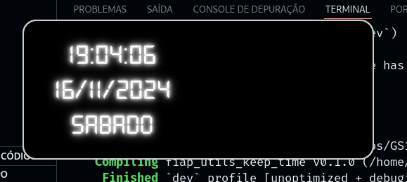

# fiap_utils_keep_time

# Tauri + React + Typescript

<div>
    
    
</div>

# Instalação dos requisitos

```bash
sudo apt update
```

```bash
sudo apt install libwebkit2gtk-4.0-dev \
    build-essential \
    curl \
    wget \
    file \
    libssl-dev \
    libgtk-3-dev \
    libayatana-appindicator3-dev \
    librsvg2-dev
```

```bash
curl --proto '=https' --tlsv1.2 -sSf https://sh.rustup.rs | sh
```

```bash
curl -fsSL https://deno.land/install.sh | sh
```

```bash
deno install
```

# Build
```bash
deno task tauri build
```
## Os arquivos para instalar ou usar diretamente estará na pasta: src-tauri/target/release/bundle

# Exec usando o código font (para devs)
```bash
deno task tauri dev
```
